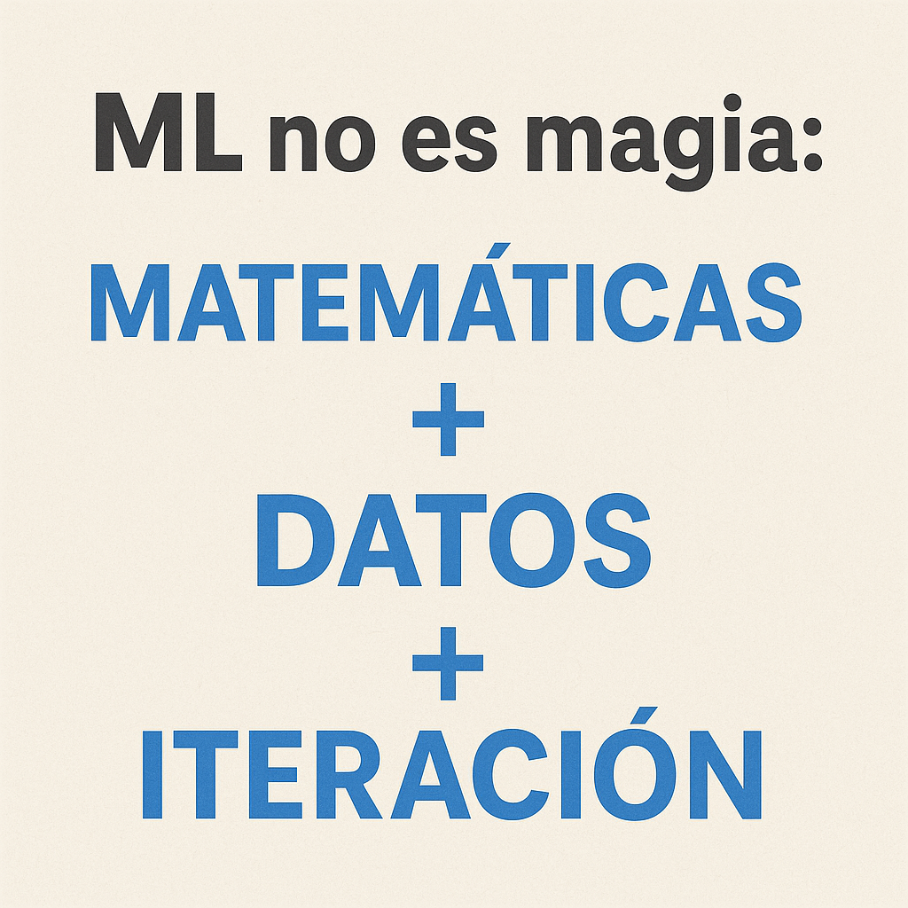

# Machine Learning

Machine Learning, o **aprendizaje automático**, es una rama de la inteligencia artificial que permite a las computadoras **aprender de los datos** sin ser programadas explícitamente. 

En lugar de instrucciones detalladas, se les proporciona una gran cantidad de información y se les permite identificar **patrones**, **predecir resultados** o **tomar decisiones** de manera **autónoma**. 

## Tipos de Machine Learning

|Tipo	|Objetivo	|Ejemplo |
|-|-|-|
|Supervisado    | Predecir algo conocido     | Clasificar emails (spam/no spam)|
|No supervisado | Encontrar patrones ocultos | Agrupar clientes por hábitos de compra|
|Por refuerzo   | Aprender por prueba/error  | Un robot que aprende a caminar|

## Conceptos Clave

* **Features (Características):** Variables de entrada (ej: hora, clima, edad).

* **Target (Etiqueta):** Lo que quieres predecir (ej: pizza/ensalada).

* **Modelo:** "Fórmula mágica" que relaciona features con target (como una receta de cocina).

* **Entrenamiento:** Ajustar el modelo con datos históricos (como estudiar para un examen).

## Algoritmos Comunes

* **Árboles de Decisión:** Hacen preguntas simples (¿Es de noche? → Pizza).

* **Redes Neuronales:** Imitan el cerebro humano (para problemas complejos como reconocer imágenes).

* **K-Means:** Agrupa datos similares (ej: segmentación de clientes).

## Proceso Básico en Código

1. **Cargar datos** (pd.read_csv)

2. **Limpiar datos** (eliminar NaN, convertir texto a números)

3. **Elegir modelo** (ej: DecisionTreeClassifier)

4. **Entrenar** (modelo.fit(X_train, y_train))

5. **Predecir** (modelo.predict(X_test))

6. **Evaluar**  (accuracy_score)

# ML no es magia: es matemáticas + datos + iteración.
